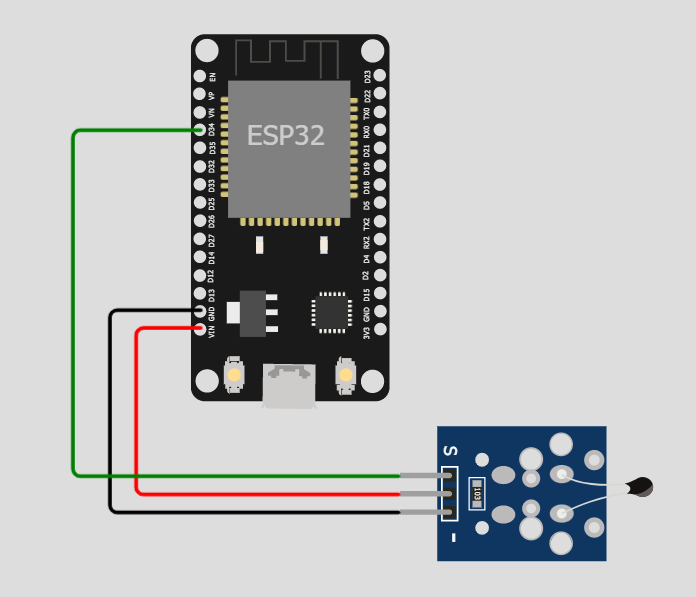
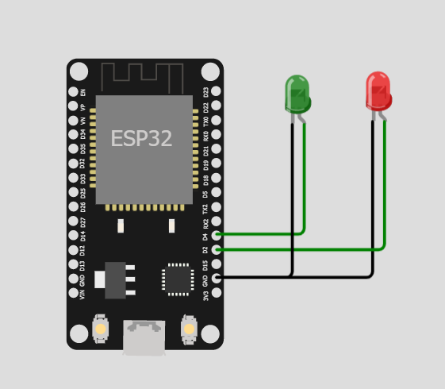

## 💡 Long range temperature signaller : เครื่องเเจ้งเตือนอุณหภูมิระยะไกล💡
# เกี่ยวกับโปรเจค
 <br>&nbsp;&nbsp;&nbsp;&nbsp;&nbsp;&nbsp;&nbsp;&nbsp;&nbsp;&nbsp;อุปกรณ์เเจ้งเตือนอุณหภูมิระยะไกล ถูกสร้างขึ้นมาโดยมีวัตถุประสงค์เพื่อนำความรู้ที่ได้ศึกษาจากบทเรียนนำมาปรับใช้ให้เกิดประโยชน์เเละ เพื่อป้องกันการเกิดอุบัติเหตุจากการเข้าใกล้บริเวณที่มีอุณหภูมิสูงเกินที่กำหนด&nbsp;&nbsp;&nbsp;&nbsp;&nbsp;&nbsp;&nbsp;&nbsp;&nbsp;&nbsp;&nbsp;&nbsp;&nbsp;&nbsp;

## ตัววัดอุณหภูมิ

```cpp
void setup() {
  pinMode(34, INPUT);
  Serial.begin(9600);
  setup_wifi();
  client.setServer(mqtt_server, 1883);
  client.setCallback(callback);

}

void loop() {
  const float BETA = 3950; // should match the Beta Coefficient of the thermistor
  int val = analogRead(34);
  // float celsius =  1 / (log(1 / (1023. / analogValue - 1)) / BETA + 1.0 / 298.15) - 273.15; this thing is busted on ESP32 for some reason
  Serial.println(val);
  // Serial.println(celsius);
  delay(1000);
  sprintf(msg, "%d", val);
  if (val <= 650){
    client.publish("ComProThermometer", "1");
    Serial.println("1");
  }
  else{
    client.publish("ComProThermometer", "0");
    Serial.println("0");
  }
  if (!client.connected()) {
    reconnect();
  }
  client.loop();

}
```
## ตัวแจ้งเตือน
 <br>&nbsp;&nbsp;&nbsp;&nbsp;&nbsp;&nbsp;&nbsp;&nbsp;&nbsp;&nbsp;ตัวเเจ้งเตือนนั้จะสามารถมีกี่ตัวก็ได้ถ้าต้องการให้เเจ้งเตือนจากตัววัดอุณหภูมิตัวเดียวกัน
 <br>&nbsp;

```cpp
void setup() {
  pinMode(2, OUTPUT);     // Initialize the BUILTIN_LED pin as an output (Red)
  pinMode(4, OUTPUT);     // Initialize the BUILTIN_LED pin as an output (Green)
  pinMode(5, OUTPUT);
  Serial.begin(115200);
  setup_wifi();
  client.setServer(mqtt_server, 1883);
  client.setCallback(callback);
}

void loop() {

  if (!client.connected()) {
    reconnect();
  }
  client.loop();
}
```
## แบบจำลองวงจร
 <br>&nbsp;&nbsp;&nbsp;&nbsp;&nbsp;&nbsp;&nbsp;&nbsp;&nbsp;&nbsp;https://wokwi.com/projects/330908529583981138 (ตัวแจ้งเตือน)
 <br>&nbsp;&nbsp;&nbsp;&nbsp;&nbsp;&nbsp;&nbsp;&nbsp;&nbsp;&nbsp;https://wokwi.com/projects/330908346752172626 (ตัววัดอุณหภูมิ)
## สรุปเนื้อหา
 <br>&nbsp;&nbsp;&nbsp;&nbsp;&nbsp;&nbsp;&nbsp;&nbsp;&nbsp;&nbsp;จำลองการสร้างอุปกรณ์ใช้เว็บไซต์ wokwi.com จำนวน 2 ชิ้นโดย ได้เเก่ ตัวเครื่องวัดอุณหภูมิที่ส่งสัญญาณไปให้กับ server โดยใช้ MQTT Protocol เมื่ออุณหภูมิถึงประมาณ 70°C เเละอีกชิ้นคือตัวรับสัญญาณที่จะสามารถมีได้ไม่จะกัดตัวเมื่อต้องการรับข้อมูลจะรับจากตัวเครื่องวัดอุณหภูมิตัวเดียวกัน ที่มีหลอด LED สีเขียว 1 หลอดที่จะเเสดงถึงการเชื่อมต่อของตัววัดอุณหภูมิกับ server เเละหลอด LED สีเเดงอีกหนึ่งหลอดที่จะสว่างขึ้นเมื่อได้รับสัญญาณว่าอุณหภูมิถึงจุดที่กำหนดเเล้ว&nbsp;&nbsp;&nbsp;&nbsp;&nbsp;&nbsp;&nbsp;&nbsp;

 ## สมาชิก
 | | รหัสนักศึกษา        | ชื่อ-นามสกุล | Github |
|:-:| :-------------: |:----------:|:--------:|
| <a></a> | 64070117    | นายอัคภพ คุณกิตติ | [Bendd4](https://github.com/Bendd4) |
| <a></a> | 64070236    | นายศิวนาถ  ธิศาเวช | [S1vanat](https://github.com/S1vanat) |
| <a></a> | 64070013    | นายจิรภัทร ณ สงขลา | [REERen](https://github.com/REERen) |

## อาจารย์ที่ปรึกษา
 - อ.กิติ์สุชาต พสุภา
 - อ.ปานวิทย์ ธุวะนุติ
##
 <br>&nbsp;&nbsp;&nbsp;&nbsp;&nbsp;&nbsp;&nbsp;&nbsp;&nbsp;&nbsp;&nbsp;&nbsp;&nbsp;รายงานนี้เป็นส่วนหนึ่งของวิชา 06016315 COMPUTER PROGRAMMING การสร้างโปรแกรมคอมพิวเตอร์
 <br>&nbsp;&nbsp;&nbsp;&nbsp;&nbsp;&nbsp;&nbsp;&nbsp;&nbsp;&nbsp;&nbsp;&nbsp;&nbsp;เทคโนโลยีสารสนเทศ สถาบันเทคโนโลยีพระจอมเกล้าเจ้าคุณทหารลาดกระบัง
